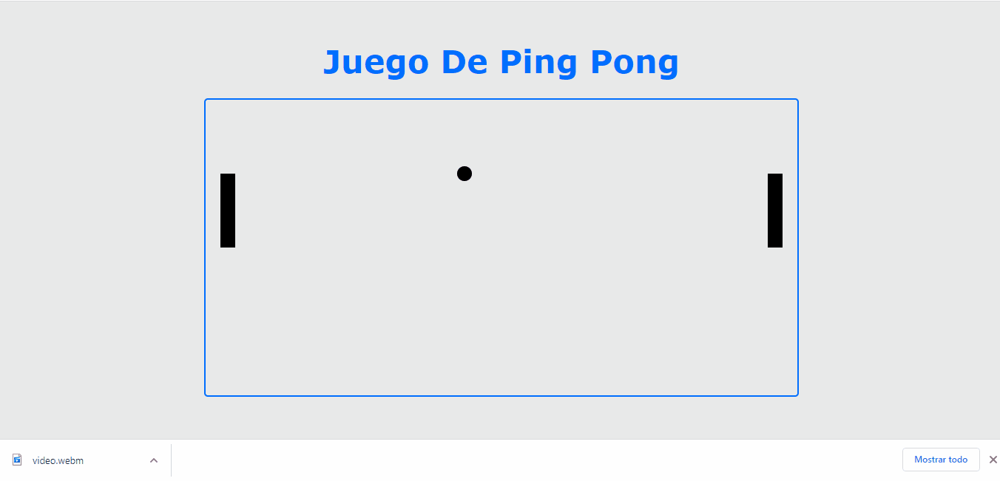

# Juego De Ping Pong

## Criterios de evaluación:

- Se debe contar con un sistema de control de versiones para evidenciar la solucion realizada por cada estudiante. ✅
- Se debe evidenciar almenos 6 commits con el avance del proyecto. ✅
- Los commit debe ser descriptivos, claro, concretos y analizados por usted. ✅

## Demo de la aplicación:

## Explicación del código:

https://github.com/JuanWebDeveloper/Ping-Pong/tree/master/img/explicacionDelCodigo.webm
